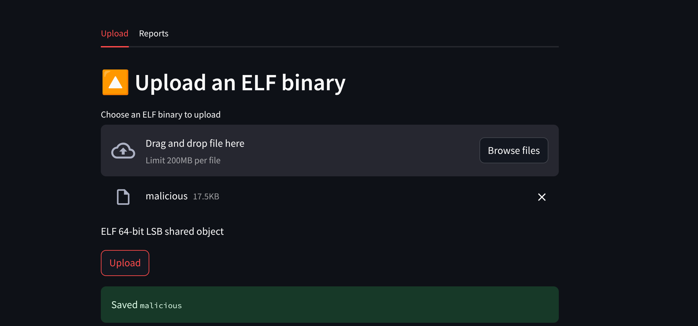
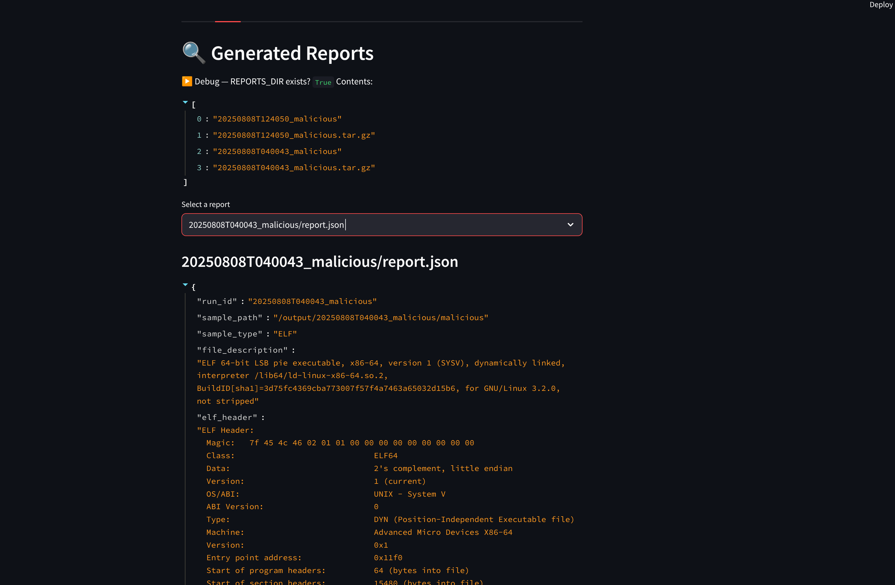
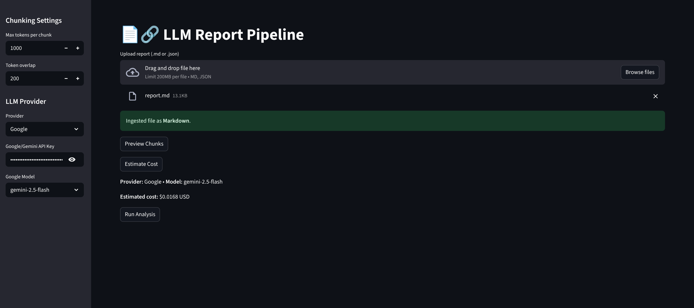
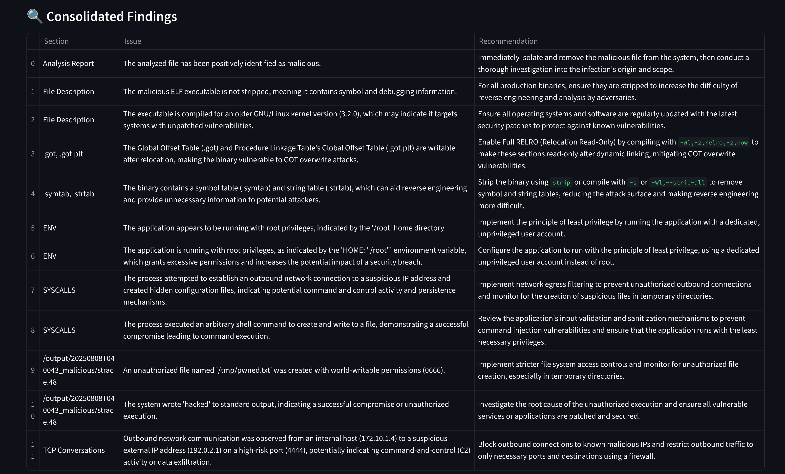

# Dynamic Threat‑Intelligence Sandbox

A containerized pipeline for **analyzing untrusted Linux ELF binaries** end‑to‑end:
- **Streamlit UI** to upload files and browse/download generated reports
- **Dispatcher** that queues uploads and **spawns isolated sandbox containers** for execution
- **Report generator (LLM)** that summarizes sandbox artifacts into **JSON + Markdown**

All services are orchestrated via **one `docker-compose.yml`**, sharing volumes for uploads and results.

---

## ✨ Features

- Single‑click upload via Streamlit, with ELF type validation
- Automatic dispatch to a Linux sandbox container from the uploader
- Report viewer that **recursively** lists `*.json` and `*.md` inside dated run folders
- One‑compose deployment (`streamlit_app`, `dispatcher`, `report`), isolated bridge network
- Named volumes:
  - `streamlit-uploads` → mounted at `/tmp/uploads`
  - `sandbox-output` → mounted at `/sandbox-output`
- Download buttons for JSON/Markdown so users **don’t need host‑volume access**

> ⚠️ **Warning**: This project executes **untrusted code** in containers. It is intended for research/education. Use at your own risk and never on production hosts.

---

**Services**
| Service        | Purpose                                             | Ports       |
|----------------|-----------------------------------------------------|-------------|
| `streamlit_app`| Upload ELF, browse/download reports                 | `5000`      |
| `dispatcher`   | Watches uploads and spawns sandbox containers       | — (internal)|
| `report`       | LLM summarizer over sandbox artifacts               | `8501`      |

**Volumes**
- `streamlit-uploads` → `/tmp/uploads` (uploader & dispatcher)
- `sandbox-output` → `/sandbox-output` (dispatcher write, uploader read‑only, report R/W)

---

## ⚙️ Prerequisites

- Docker & Docker Compose
- (For the LLM report service) API keys in environment:
  - `OPENAI_API_KEY`
  - `GOOGLE_API_KEY` (if you use Gemini in your pipeline)

Create a `.env` from the provided template:

```bash
cp .env.example .env
# then edit .env to set your keys
```

---

## 🚀 Quickstart

```bash
# from repo root
docker compose up --build
```

- Streamlit UI: **http://localhost:5000**
- (Optional) Report service UI: **http://localhost:8501**

**Flow**
1. Open the Streamlit UI → *Upload ELF*
2. The file is validated and saved to `/tmp/uploads`
3. The dispatcher is notified and spawns a sandbox container, writing results to `/sandbox-output`
4. Open *Generated Reports* tab to see dated run directories (e.g., `20250807T125248_malicious/`)
5. Select `report.json` or `report.md` to **preview** and **download**

---

## 🛠️ Configuration

- **Compose network**: user‑defined bridge (`sandbox_net`)
- **Named volumes**: declared once; containers mount them as needed
- **Dispatcher**: requires access to Docker engine. In compose:
  ```yaml
  dispatcher:
    volumes:
      - /var/run/docker.sock:/var/run/docker.sock
  ```
- **Streamlit report viewer**: mounts `sandbox-output` **read‑only**:
  ```yaml
  streamlit_app:
    volumes:
      - outputs:/sandbox-output:ro
  ```

> If you prefer to see files on the host, switch to bind‑mounts (e.g., `./uploads:/tmp/uploads`).  
> This project defaults to **named volumes** and surfaces reports inside the UI for convenience.

---

## 📁 Repository Layout (example)

```
.
├─ uploader/                 # Streamlit UI
│  ├─ app.py / setup.py
│  ├─ requirements.txt
│  └─ Dockerfile
├─ dispatcher/               # Watches uploads, spawns sandbox
│  ├─ dispatcher.py
│  └─ Dockerfile
├─ report-generator/         # LLM summarizer
│  ├─ main.py  ingestion.py  chunker.py  llm_client.py  cost_estimator.py
│  ├─ requirements.txt
│  └─ Dockerfile
├─ docker-compose.yml
├─ .env.example
└─ docs/
   └─ screenshots/
      ├─ upload.png
      ├─ reports.png
      └─ json-view.png
```

---

## 🖼️ Screenshots


| Upload ELF | Reports list | JSON view | Report Format
|---|---|---|---|
|  |  |  | 

---

## 🔎 How it works (brief)

1. **Upload**: Streamlit validates with `python-magic` and saves to `/tmp/uploads`.
2. **Dispatch**: The UI notifies the dispatcher (HTTP/queue). The dispatcher mounts the uploaded binary **read‑only** into a fresh sandbox container and runs the analysis.
3. **Artifacts**: The sandbox writes a dated run directory (and a `.tar.gz`) into `/sandbox-output`.
4. **Summarize**: The report service reads artifacts, produces `report.md` + `report.json` into the same folder.
5. **View/Download**: Streamlit recursively lists `*.json`/`*.md` under `/sandbox-output`, renders them, and exposes **Download** buttons.

---

## 🧪 Troubleshooting

- **Reports not showing in UI**
  - Confirm the `outputs:/sandbox-output` mount exists under **both** `dispatcher` and `streamlit_app`.
  - Use a debug `st.write(os.listdir("/sandbox-output"))` to verify contents.
  - Remember: with **named volumes**, files live under Docker’s data dir (not your repo). UI is the intended viewer.

- **Uploader label warning**: Streamlit requires a non‑empty label. Set `label_visibility="collapsed"` if you want it hidden.

- **Docker socket permission**: Dispatcher needs to talk to Docker. Ensure Docker Desktop/Linux user grants access to `/var/run/docker.sock`.

- **LLM keys**: Ensure `.env` exposes `OPENAI_API_KEY` / `GOOGLE_API_KEY` to the `report` service.

- **`python-magic` issues**: Ensure libmagic is present in the uploader image.

---

## 🔐 Security Notes

- Untrusted binaries run in a **throwaway container**. Tighten isolation:
  - Drop caps, set `no-new-privileges`, user namespaces, seccomp/apparmor profiles, CPU/mem/pids limits.
  - Keep mounts **read‑only** where possible and avoid host network.
- Never expose the dispatcher externally.

---

## 🗺️ Roadmap

- In‑container **queue** for uploads (rate‑limit & retry policy)
- **Parallel workers** for higher throughput
- Windows PE & macOS Mach‑O support
- **Local LLM** mode (e.g., Ollama) to keep data on‑device
- Pluggable sandbox images and policy packs

---

